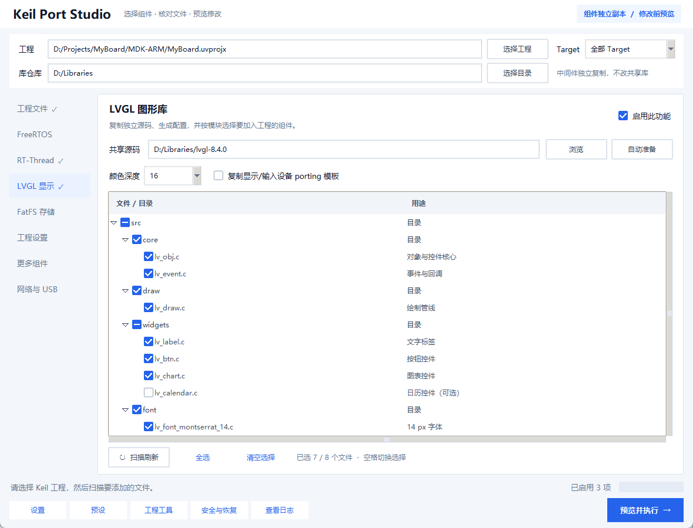

# Graphical interface guide

[简体中文](GUI.zh-CN.md)

**This release targets CubeMX-generated STM32 HAL + Keil projects.** SPL and custom
layouts are outside automatic-porting acceptance. Read the [scope](SUPPORT.en.md);
adding project references is not proof of runtime correctness.

Select `zh-CN / en` in the upper-right corner to switch language without losing
file selections. **Guide** opens offline tutorials; see [required post-porting
work](POST-PORTING.en.md) and [Git workflow](GIT.en.md). Some backend diagnostics
and raw tool output are retained in their original language.

The left sidebar selects a page; it does not enable that feature. Check the
enable control in the page header to include it in the operation. The footer
shows the number of enabled features.

## Workflow

1. Choose a `.uvprojx` / `.uvproj` and the intended Target. Close that project in Keil first.
2. Choose the middleware source repository. Component migration makes a private
   project copy rather than changing the shared library.
3. Open a component page, enable it, and select its source or prepare it automatically.
4. Inspect actual source files and descriptions. Uncheck unwanted files; required
   dependencies are still validated by the backend.
5. Select the preview-and-execute button, review changes and warnings, then confirm.
   Cancelling the preview does not apply the project changes.
6. Reload the project in Keil, compile, and perform the relevant hardware tests.
   A successful build does not prove a working hardware port.

The general project-files page adds references to existing files; it is **not a
source-copy operation**. Copy ordinary shared C/H/library files into the project
before scanning if they must be isolated. Display, network, Flash, SD and USB
drivers must still match the actual wiring and clocks.

## Selection behavior

- Tick: selected. Empty square: unselected. Dash: partially selected folder.
- Click a name or press Space to toggle; selecting a folder applies to its children.
- Clicking the expansion arrow only opens/closes a folder, without toggling it.
- First scan selects everything. Refreshing the same root preserves existing
  choices; newly found files are selected by default.
- The footer shows selected/total files. Restoring a preset does not silently
  include files that were absent from its saved selection.

FreeRTOS and RT-Thread are mutually exclusive within one project. The execute
button is disabled while both are selected. The explicit RTOS mode for FatFS,
LittleFS and LwIP follows the project's kernel; auto-detection is the usual choice.
Older preset labels remain recognized.

## Windows and utilities

Logs open separately so file details retain their space. Project settings scroll,
including keyboard focus reveal. Settings, presets, project tools, and recovery
are in the bottom toolbar. Layouts were checked at 980×650 and 1180×800, with
100%, 125%, and 150% scaling; this is not certification of every mixed-DPI setup.

Downloads, migration transactions, uninstall/rollback and Keil builds run on a
worker; logs and confirmation dialogs stay on Tk's owning thread. Busy operations
block re-entry, language changes and closing. Cancel at the diff preview, not by
force-interrupting a write. Scanning and large file-tree population still include
synchronous work. See the [reliability notes](RELIABILITY.en.md).

This guide covers the interface, not the full component integration, test matrix,
or release notes.
